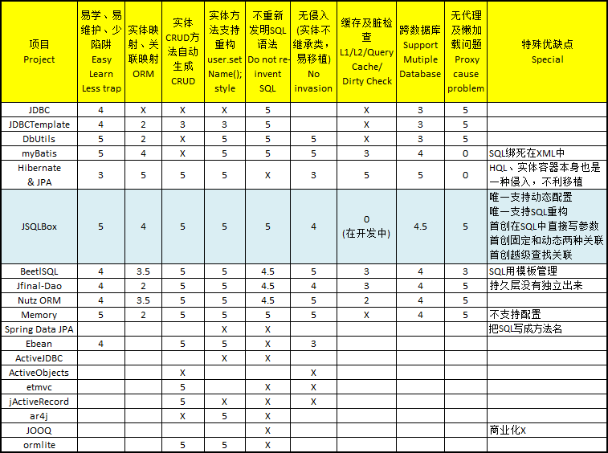

##jSQLBox (In Developing)
**License:** [Apache 2.0](http://www.apache.org/licenses/LICENSE-2.0)  

jSQLBox是一个微型的、易学易用的、支持简单的O-R映射的工具，目标是用来代替功能强大但过于复杂的Hibernate,以及一些简单的但功能不尽人意的持久层工具如MyBatis/JDBC/JDBCTemplate/DButils/EBean/OpenJPA/jFinal/jActiveRecord/ActiveJDBC/JOOQ等。目前jSQLBox项目正在开发阶段，欢迎有兴趣者加入。

一张对比图显示jSQLBox项目的定位和开发目标：(打分仅为个人看法，5分制，X表示不及格, 空着的表示不了解，不好打分）



###为什么要开发jSQLBox?
因为作者发现了一种利用Java来代替XML和Annotation配置的方法，凡是利用XML和Annotation作为配置文件的项目，都存在着XML不支持重构、Annotation不够灵活，配置文件不能动态生成、修改的问题，这对于需要动态生成或修改配置的场合是个致命缺陷。作者在开发完jBeanBox项目后，发现Hibernate和MyBatiis这两个流行的持久层工具也都存在这个问题，这是jSqlBox项目产生的原因，简单说，jSqlBox的开发目标就是一个支持动态配置的Hibernate，当然，做了极大的简化以降低开发和使用难度。
在开发过程中，作者发现了一些Hibernate的问题,归纳如下:
1)如上，配置是固定的，不能动态变化，对于需要在运行期动态创建或改变表名、列名、映射方式的场合，解决起来比较麻烦。
2)缺省情况下，实体类为容器管理，导致任何对PO的更改都会写入数据库，这使得PO不能和VO合并，不能直接传递到View层使用。
3)HQL语言是重复发明轮子，HQL语言本身不是面向对象的，不支持IDE拼写检查和重构。
4)过度复杂，源码庞大(上万个类)，虽然号称对PO类无侵入，但实际上ORM架构本身就是最大的侵入，采用了ORM架构的项目就绑死在了Hibernate/JPA这种复杂的ORM工具上了。

###jSQLBox主要功能简介:  
*提供CRUD方法，CRUD占持久层日常~70%的工作量，对一个持久层工具来说自动生成CRUD方法是必须提供的基本功能。   
*基于ActiveRecord模式，无DAO显式注入。  
*不重新发明SQL,直接使用原生SQL，只有这一种查询语言。  
*对SQL的包装，jSqlBox首创字符串拼接的SQL参数自动包装成preparedStatement，防止SQL注入，精简代码，提高可读性和可维护性。  
*是目前唯一支持原生SQL重构的持久化工具，数据库列名变动、PO类字段变动直接由IDE的重构功能来管理。  
*低侵入，PO类只需要声明实现Entity接口即可(仅对Java8+,对于Java7及以下需要继承EntityBase类)。  
*无配置，默认情况下，PO类自动适应数据库表，字段自动匹配驼峰式或下划线式数据表列名，无需任何配置文件。  
*可配置，当数据库表名、字段名与缺省匹配规则不一致时，可用配置的方式来解决，配置为纯Java类，类似jBeanBox项目。  
*多配置和动态配置，同一个PO可采用不同的配置以进行多种方式的存取,配置可以继承重用已有的配置，配置可以动态生成和修改，这是XML和Annotation配置方式无法实现的。  
*(开发中)一级缓存与脏检查，与Hibernate类似，提供以ID为主键的行级缓存，一级缓存在跨越多个方法的同一事务中有效，对PO代理实例的存取不再重复访问数据库，除低数据库压力。  
*(开发中)二级缓存支持，建立在一级缓存基础上的二级缓存，可采用第三方工具如EHcache，Redis等。  
*多主键支持，一级缓存支持多主键，适于开发使用了业务主键的（遗留）数据库。  
*跨数据库, 内核建立在SpringJdbcTemplate上，只要JDBC支持的数据库都可以用，目前已在H2,MySql,Oracle上测试过，今后将加入更多数据库类型测试。  
*建立在E-R建模基础上，没有对象关联、LazyLoad带来的OpenSessionInView问题和N+1问题, PO类可以直接传递到View层(JSP)，PO自带Dao属性, 在View层事务不存在的情况下，依然可以继续存取数据库(通常只读)。  
*(开发中)支持简单的O-R映射，有一对一，一对多，多对多，树结构四种映射类型 ，但与Hibernate/JPA不同的是它只负责从数据库读，不负责写。  
*易学易维护易扩充，借用成熟工具(内核建立在Spring的JdbcTemplate上，事务管理借用Spring的声明式事务)，核心类只有约15个Java类，是一个能够轻松架驭的微型工具。  
*(开发中)版本检查功能  

###jSQLBox缺点:  
*比较新，缺少足够测试，缺少开发者（欢迎试用或加入项目，任何建议和批评都会促使它不断改进）  
*实体映射比较简单，只负责从数据库读，不负责写，由用户自行管理内存对象到数据库的写入操作。  
*没有懒加载功能，实体类的属性字段只能是简单类型，不能是复杂的实体类型或集合类型，即使定义了实体或集合类型，也需要手工进行O-R关联来载入。  
*为了最大程序地支持原生SQL重构, 分页、全文检索等专用功能不包含在这个项目中，需用户自行实现。  


How to use jSQLBox?  
To be released into Maven central repository

How to import jSQLBox project into Eclipse(for developer)?  
1)install JDK1.7+, Git bash, Maven3.3.9+, on command mode, run:
2)git clone https://github.com/drinkjava2/jSQLBox
3)cd jsqlbox
4)mvn eclipse:eclipse
5)mvn test
6)Open Eclipse, "import"->"Existing Projects into Workspace", select jsqlbox folder, there are 2 module projects "jsqlbox" and "jsqlbox-test" will be imported in Eclipse. 

jSQLBox说明文档：
---
Example 1 - 入门示例1
```
	public static void main(String[] args) {
		ComboPooledDataSource ds = new ComboPooledDataSource();//c3p0池设定
		ds.setUser("root");
		ds.setPassword("root888");
		ds.setJdbcUrl("jdbc:mysql://127.0.0.1:3306/test?rewriteBatchedStatements=true&useSSL=false");
		ds.setDriverClass("com.mysql.jdbc.Driver"); 

		SqlBoxContext ctx = new SqlBoxContext(ds);//生成SqlBoxContext上下文实例
		User u = ctx.create(User.class); //根据类名创建PO实例
		u.setUserName("User1");
		u.setAddress("Address1");
		u.setPhoneNumber("111");
		u.setAge(10);
		u.dao().save(); //保存到数据库 
	} 
```

Example 2 - 入门示例2
```
		Customer c = new Customer().configAlias("c"); //配置别名为"c"
		c.box().configTable("customer2");  //动态改变配置表名为"customer2"
		c.setCustomerName('张三');
		c.insert(); //存盘		
 
		Order o = new Order().configAlias("o");
		OrderItem i = new OrderItem().configAlias("i");
		mapping(oneToMany(), c.ID(), o.CUSTOMERID()); //一对多关联
		mapping(oneToMany(), o.ID(), i.ORDERID());    //一对多关联
		Customer c2= Dao.queryForEntity(select(), c.all(), ",", o.all(), ",", i.all(), from(),
				c.table(), //
				" left outer join ", o.table(), " on ", c.ID(), "=", o.CUSTOMERID(), //
				" left outer join ", i.table(), " on ", o.ID(), "=", i.ORDERID(), //
				" order by ", o.ID(), ",", i.ID());
 		System.out.println(c2.getOrderList()[0].getOrderItemList()[0].getItemName());
```		

Example 3 - 用IOC工具jBeanBox或Spring来注入上下文实例， 关于jBeanBox项目见https://git.oschina.net/drinkjava2/jBeanBox)
```
	public static void main(String[] args) {
		SqlBoxContext ctx = BeanBox.getBean(CtxBox.class);//注入SqlBoxContext实例
		User u = ctx.create(User.class); //create an entity instance
		u.setUserName("User1");
		u.setAddress("Address1");
		u.setPhoneNumber("111");
		u.setAge(10);
		u.insert(); 
	 
	} 
```

Example 4 - 利用缺省上下文简化编程
```
	public static void main(String[] args) {
		SqlBoxContext.DEFAULT_SQLBOX_CONTEXT.setDataSource((DataSource) BeanBox.getBean(DataSourceBox.class));
		User u = new user();
		u.setUserName("User1");
		u.setAddress("Address1");
		u.setPhoneNumber("111");
		u.setAge(10);
		u.insert(); 	 
	}
 
```

Example 5 - 对SQL的支持，参数暂存在Threadlocal中，SQL执行时自动转化为preparedStatement
```
    Dao.execute("update users set username=?,address=? ", empty("John", "Shanghai"), " where age=", q(30));  
    Dao.execute("update users set", //  
            " username=?", empty("Peter"), //  
            ",address=? ", empty("Nanjing"), //  
            " where age=?", empty(40));  
    Dao.execute("update users set", //  
            " username=", q("Jeffery"), //  
            ",address=", q("Tianjing"), //  
            " where age=", q(50));  
    Dao.execute("insert into users ", //  
            " (username", empty("Andy"), //  
            ", address", empty("Guanzhou"), //  
            ", age)", empty("60"), //  
             SqlHelper.questionMarks());  
```

Example 6 - 批量插入10000行数据，耗时~5秒,同样sql自动转为preparedStatement,不存在Sql注入问题
```
    public void tx_batchInsertDemo() {  
        for (int i = 6; i < 100000; i++)  
            Dao.cacheSQL("insert user (username,age) values(",q("user"+i)+",",q(60),")");  
        Dao.executeCatchedSQLs();  
    }  
```

Example 7 - 实现动态拼接SQL进行条件查询，不存在Sql注入安全问题
```
public int conditionQuery(int condition, Object parameter) {//动态拼接SQL查询   
            User u = new User();   
            String sql = "Select count(*) from " + u.Table() + " where ";   
            if (condition == 1 || condition == 3)   
                sql = sql + u.UserName() + "=" + q(parameter) + " and " + u.Address() + "=" + q("Address1");   
       
            if (condition == 2)   
                sql = sql + u.UserName() + "=" + q(parameter);   
       
            if (condition == 3)   
                sql = sql + " or " + u.Age() + "=" + q(parameter);   
       
            return Dao.queryForInteger(sql);   
        }   
       
        @Test   
        public void doJdbcConditionQuery() {   
            Assert.assertEquals(1, conditionQuery(1, "User1"));   
            Assert.assertEquals(0, conditionQuery(2, "User does not exist"));   
            Assert.assertEquals(1, conditionQuery(3, 10));   
            Assert.assertEquals(0, conditionQuery(3, 20));   
        }    
```

Example 8 - 事务支持, 利用了Spring的事明式事务
```
	@AopAround(SpringTxInterceptorBox.class) //方法将包装在事务中
	public void insertUser() {
		User u = new User(); 
		u.setUserName("User2");
		u.setAddress("Address2");		 
		u.setAlive(true); 
		u.insert(); 
	} 

	public static void main(String[] args) {
		InsertTest t = BeanBox.getBean(InsertTest.class); //获取代理实例
		t.insertUser();  
	}

```

Example 9 来看一下实体类的写法，没有JPA注解，不继承任何基类，但必须声明实现Entity接口,userName对应的数据库字段可为USER_NAME或username,自动匹配，无须手工调整
```
public class User implements Entity{ 
	 private Integer id;
	private String userName;
	private String phoneNumber;
	private String address;
	private Integer age;
	private Boolean active;
	//Getter & Setter 略

	//以下方法不是必须的，但是jSqlBox建议具有，以实现对SQL重构的支持:
	public String ID() {
		return box().getColumnName("id");
	}

	public String USERNAME() {
		return box().getColumnName("userName");
	}

	public String PHONENUMBER() {
		return box().getColumnName("phoneNumber");
	}

	public String ADDRESS() {
		return box().getColumnName("address");
	}

	public String AGE() {
		return box().getColumnName("age");
	}

	public String ACTIVE() {
		return box().getColumnName("active");
	}
}

```

Example 10 - User类数据库的表名和字段是可配置的，只要在User类同目录下放一个名为UserBox的类即可，配置实例可在运行期调用box()方法获得并更改，这称为动态配置，与jBeanBox项目类似
```
public class UserBox extends SqlBox {
	{
		this.configTableName("usertable2");
		this.configColumnName(User.UserName, "User_Name_");
		this.configColumnName(User.Address, "Address2");
		this.configColumnName(User.PhoneNumber, "Phone");
	}	
}

```

更多功能如O-R关联查询、一级缓存、二级缓存、版本检查等功能正在编码中，有兴趣的也欢迎加入。


 

